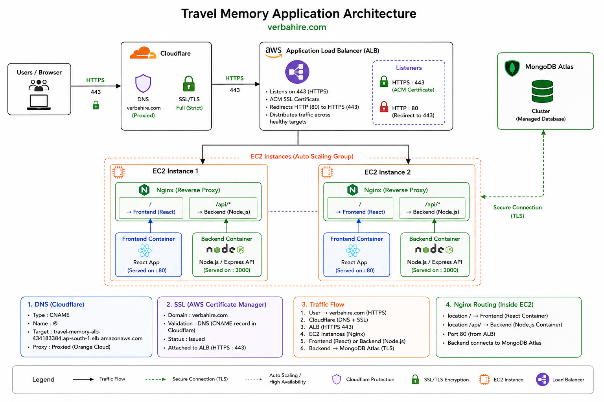

# Travel Memory Deployment Documentation

## Repository

```text
https://github.com/Shashankd48/hero-vired-assignment-04
```

---

# Deployment Architecture




---

# Infrastructure Overview

| Component        | Configuration                 |
| ---------------- | ----------------------------- |
| Cloud Provider   | AWS                           |
| Compute          | 2 × EC2 (Ubuntu)              |
| Containerization | Docker & Docker Compose       |
| Reverse Proxy    | Nginx                         |
| Load Balancer    | AWS Application Load Balancer |
| Database         | MongoDB Atlas                 |
| DNS              | Cloudflare                    |
| SSL              | AWS Certificate Manager (ACM) |

---

# 1. EC2 Instance Provisioning

Two Ubuntu EC2 instances were launched to host the application. Both instances were configured identically to provide redundancy and high availability.

The instances were accessed using SSH.

```bash
ssh -i "./root_key_test01.pem" ubuntu@13.232.241.170

ssh -i "./root_key_test01.pem" ubuntu@13.204.83.155
```

The deployment steps described below were performed on both EC2 instances.

---

# 2. Docker Installation

Docker Engine and Docker Compose were installed on both EC2 instances.

### Remove Existing Docker Installation

```bash
sudo apt remove docker docker-engine docker.io containerd runc
```

### Update Package Repository

```bash
sudo apt update
```

### Install Required Packages

```bash
sudo apt install -y ca-certificates curl gnupg
```

### Add Docker Repository

```bash
sudo install -m 0755 -d /etc/apt/keyrings

curl -fsSL https://download.docker.com/linux/ubuntu/gpg | \
sudo gpg --dearmor -o /etc/apt/keyrings/docker.gpg

sudo chmod a+r /etc/apt/keyrings/docker.gpg

echo \
"deb [arch=$(dpkg --print-architecture) signed-by=/etc/apt/keyrings/docker.gpg] \
https://download.docker.com/linux/ubuntu \
$(. /etc/os-release && echo "$VERSION_CODENAME") stable" | \
sudo tee /etc/apt/sources.list.d/docker.list > /dev/null
```

### Install Docker Engine

```bash
sudo apt update

sudo apt install -y docker-ce docker-ce-cli containerd.io docker-buildx-plugin docker-compose-plugin
```

### Enable Docker Service

```bash
sudo systemctl enable docker

sudo systemctl start docker
```

### Allow Current User to Run Docker

```bash
sudo usermod -aG docker $USER

newgrp docker
```

### Verify Installation

```bash
docker --version

docker compose version
```

---

# 3. Application Deployment

An application directory was created under `/opt/apps`.

```bash
sudo mkdir -p /opt/apps

sudo chown ubuntu:ubuntu /opt/apps

cd /opt/apps
```

The application repository was cloned.

```bash
git clone https://github.com/Shashankd48/hero-vired-assignment-04.git travel-memory

cd travel-memory
```

---

# 4. Environment Configuration

The backend environment file was created.

```text
backend/.env
```

The following environment variables were configured.

```env
PORT=3000

MONGO_URI=<MongoDB Atlas Connection String>

NODE_ENV=production
```

The frontend environment file was created.

```text
frontend/.env
```

The frontend was configured to communicate with the backend through the Nginx reverse proxy.

```env
NODE_ENV=production
REACT_APP_API_URL=/api
```

MongoDB Atlas was used as the application's managed database.

---

# 5. Container Deployment

Docker Compose was used to build and start the application containers.

```bash
docker compose up -d --build
```

The running containers were verified.

```bash
docker ps
```

Application logs were verified.

```bash
docker compose logs
```

The same deployment process was repeated on the second EC2 instance.

---

# 6. Reverse Proxy Configuration

Nginx was configured as the reverse proxy on each EC2 instance.

Routing configuration:

```text
/          → React Frontend

/api/*     → Node.js Backend
```

This configuration allows the frontend and backend to be served from a single domain.

Application URLs:

```text
https://verbahire.com

https://verbahire.com/api
```

---

# 7. Security Group Configuration

### EC2 Security Group

| Type | Port | Source             |
| ---- | ---- | ------------------ |
| SSH  | 22   | My IP              |
| HTTP | 80   | ALB Security Group |

Outbound Rules

* Allow All

### Application Load Balancer Security Group

| Type  | Port | Source   |
| ----- | ---- | -------- |
| HTTP  | 80   | Anywhere |
| HTTPS | 443  | Anywhere |

Outbound Rules

* Allow All

This configuration ensures that application traffic reaches the EC2 instances only through the Application Load Balancer.

---

# 8. Target Group Configuration

An Application Target Group named **travel-memory-tg** was created.

Configuration:

| Property          | Value    |
| ----------------- | -------- |
| Target Type       | Instance |
| Protocol          | HTTP     |
| Port              | 80       |
| Health Check Path | /        |

Both EC2 instances were registered with the target group.

The health status of both instances was verified before attaching the target group to the load balancer.

---

# 9. Application Load Balancer

An Internet-facing Application Load Balancer named **travel-memory-alb** was created.

Configuration:

| Property        | Value           |
| --------------- | --------------- |
| Scheme          | Internet Facing |
| IP Address Type | IPv4            |
| Listener        | HTTP (80)       |

The **travel-memory-tg** target group was attached to the HTTP listener.

The generated DNS endpoint was:

```text
travel-memory-alb-434183384.ap-south-1.elb.amazonaws.com
```

The Application Load Balancer distributes incoming requests across both EC2 instances.

---

# 10. Cloudflare DNS Configuration

The custom domain **verbahire.com** was configured using Cloudflare.

A CNAME record was created to point the root domain to the AWS Application Load Balancer.

| Type  | Name | Target                                                   |
| ----- | ---- | -------------------------------------------------------- |
| CNAME | @    | travel-memory-alb-434183384.ap-south-1.elb.amazonaws.com |

The record was configured with **Proxy Status enabled**.

---

# 11. SSL Certificate Configuration

An SSL certificate was requested from AWS Certificate Manager (ACM).

Configuration:

| Property   | Value         |
| ---------- | ------------- |
| Domain     | verbahire.com |
| Validation | DNS           |

AWS ACM generated a DNS validation record.

The generated CNAME record was added to Cloudflare with **DNS Only** mode enabled.

Once DNS validation completed, the certificate status changed to **Issued**.

---

# 12. HTTPS Configuration

A new HTTPS listener was added to the Application Load Balancer.

| Property    | Value           |
| ----------- | --------------- |
| Protocol    | HTTPS           |
| Port        | 443             |
| Certificate | ACM Certificate |

The HTTPS listener forwards traffic to the existing target group.

The HTTP listener was updated to redirect all requests to HTTPS using a **301 Permanent Redirect**.

---

# 13. Cloudflare SSL Configuration

Cloudflare SSL/TLS encryption mode was configured as:

```text
Full (Strict)
```

This ensures secure encrypted communication between:

* Client → Cloudflare
* Cloudflare → AWS Application Load Balancer

---

# 14. Deployment Verification

The deployment was verified by confirming the following:

* Both EC2 instances are healthy.
* Target Group health checks pass successfully.
* Docker containers are running on both instances.
* Nginx correctly proxies frontend and backend requests.
* React application is accessible over HTTPS.
* Backend APIs are accessible through `/api`.
* MongoDB Atlas connectivity is successful.
* Application Load Balancer distributes requests between both EC2 instances.
* HTTP requests are automatically redirected to HTTPS.
* SSL certificate is successfully applied to the custom domain.

---

# Application URLs

| Service     | URL                       |
| ----------- | ------------------------- |
| Frontend    | https://verbahire.com     |
| Backend API | https://verbahire.com/api, https://verbahire.com/api/health  |
